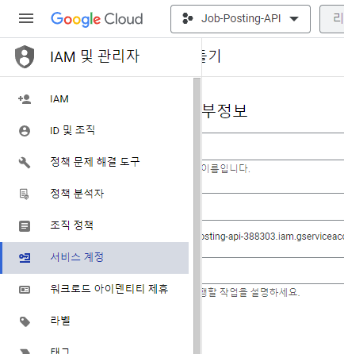
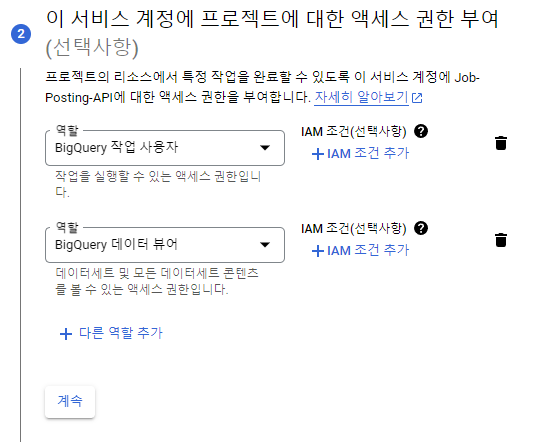
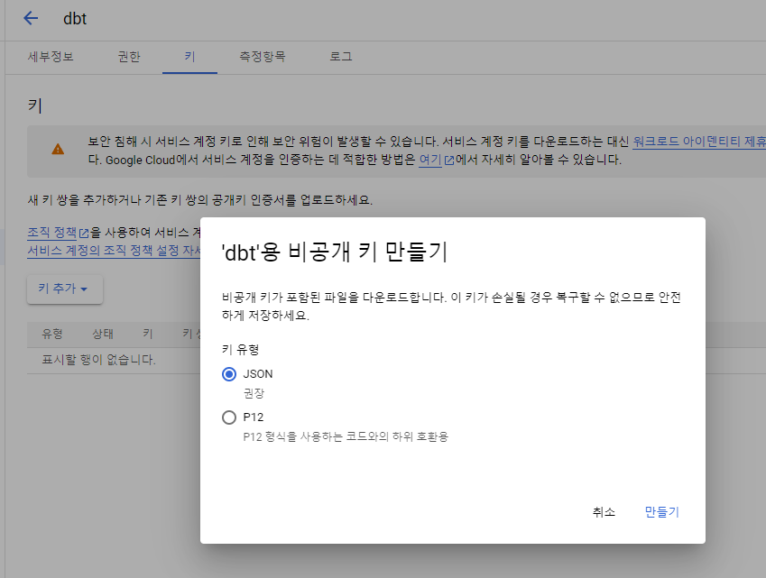

# BigQuery_ServiceAccount

1. IAM에서 서비스 어카운트 생성   
   
2. 필요 권한
   - BigQuery 작업 사용자 (roles/bigquery.jobUser)
   - BigQuery 데이터 뷰어 (roles/bigquery.dataViewer)
   
3. 키 생성 (JSON)   
   -> {project}-388303-54e554e9738f.json 대충 이런 키 생성

