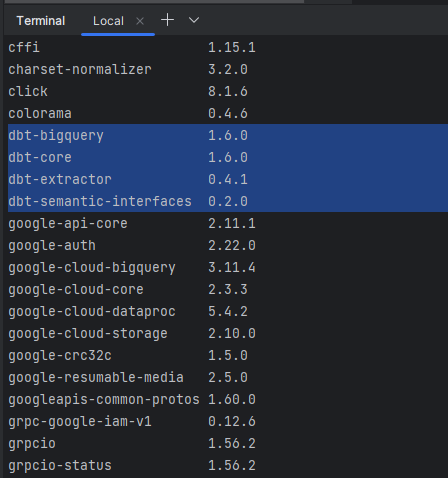

# dbt install (BigQuery)

- - -

### dbt install (BigQuery)
1. `pip install dbt-bigquery`   
   (dbt-core 포함 설치)   
    

2. `dbt --version`
    ```
    Core:
      - installed: 1.6.0
      - latest:    1.6.0 - Up to date!
    
    Plugins:
      - bigquery: 1.6.0 - Up to date!
    ```
3. dbt 프로젝트 생성   
   1. `dbt init dbt_bq`
   2. 프로젝트 설정
      1. database 설정 -> 다운받은 패키지가 나온다.
      2. a의 데이터베이스에 따라 인증방법과 인증, 스키마 등 설정
      ```
      Setting up your profile.
      Which database would you like to use?
      [1] bigquery
       
      Enter a number: 1
      ```
      ```
      [1] oauth
      [2] service_account
      Desired authentication method option (enter a number): 2
      keyfile (/path/to/bigquery/keyfile.json): ./{ACCESS_KEY}.json
      project (GCP project id): job-posting-api-388303
      dataset (the name of your dbt dataset): dbt 
      threads (1 or more): 1
      job_execution_timeout_seconds [300]: 300
      [1] US
      [2] EU
      Desired location option (enter a number): 1
      15:28:50  Profile dbt_bq written to C:\Users\**\.dbt\profiles.yml using target's profile_template.yml and your supplied values. Run 'dbt d
      ebug' to validate the connection.
```
4. 
